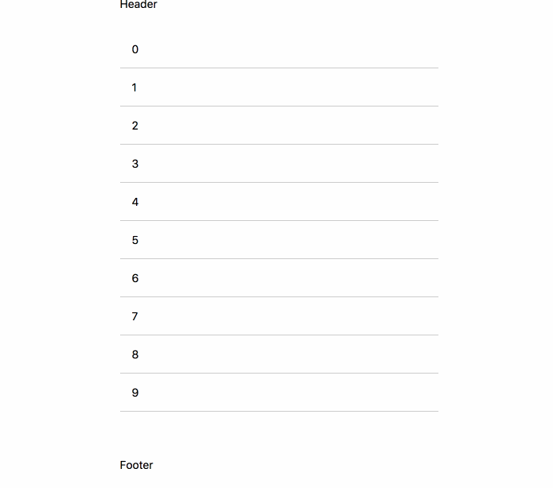

# react-scroll-shadow [](https://travis-ci.org/zzarcon/react-scroll-shadow)
> Pure CSS shadow to indicate more content in scrollable area

<div align="center">
  
  <br><br>
</div>

# Demo 🍿

[https://zzarcon.github.io/react-scroll-shadow](https://zzarcon.github.io/react-scroll-shadow)

# Install 🚀

```
$ yarn add react-scroll-shadow
```

# Usage ⛏

**Basic** 

```tsx
import ScrollShadow from 'react-scroll-shadow';

<ScrollShadow>
  Content
</ScrollShadow>
```

**Custom**

```tsx
import ScrollShadow from 'react-scroll-shadow';

<ScrollShadow
  bottomShadowColors={{
    active: 'red',
    inactive: 'white'
  }}
  topShadowColors={{
    active: 'blue',
    inactive: 'white'
  }}
  shadowSize={2}
>
  Content
</ScrollShadow>
```

# Api 📚

```ts
interface ShadowColors {
  inactive: string;
  active: string;
}

interface Props {
  height?: string;
  bottomShadowColors?: ShadowColors;
  topShadowColors?: ShadowColors;
  shadowSize?: number;
}
```

See [example/](https://github.com/zzarcon/react-scroll-shadow/tree/master/example) for full example.